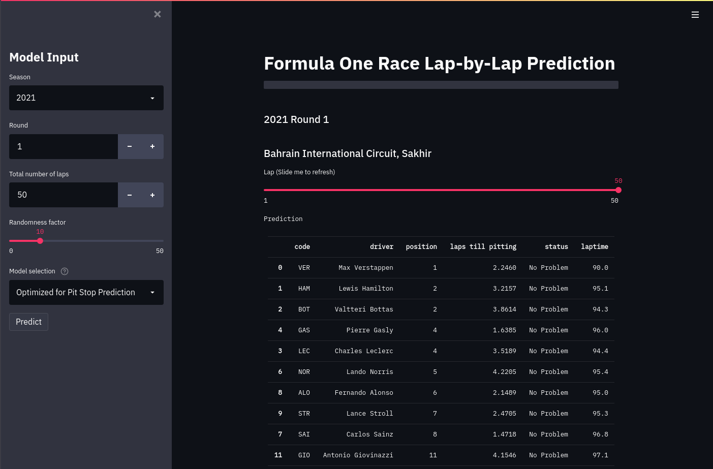
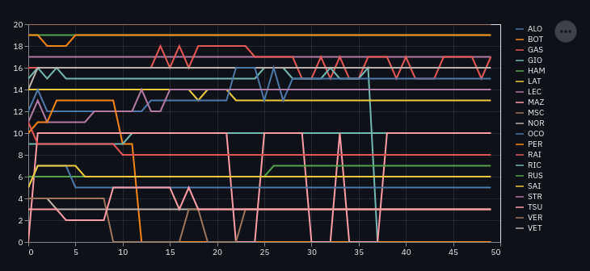
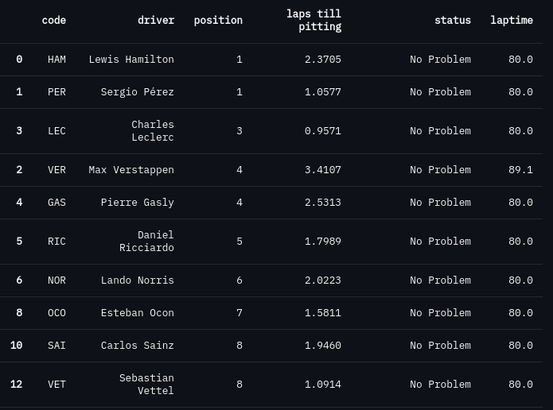
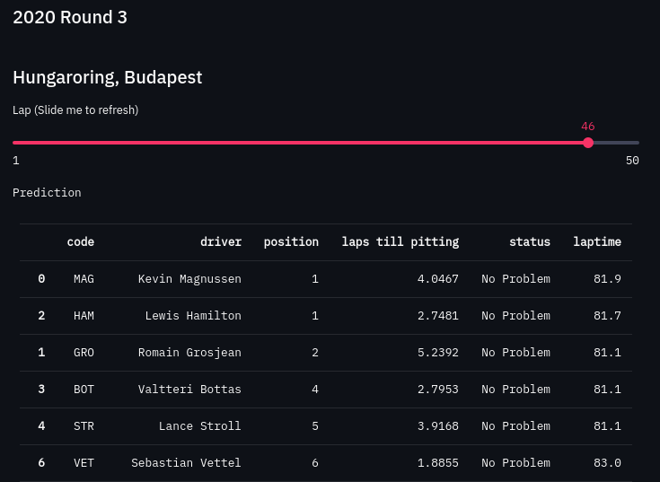
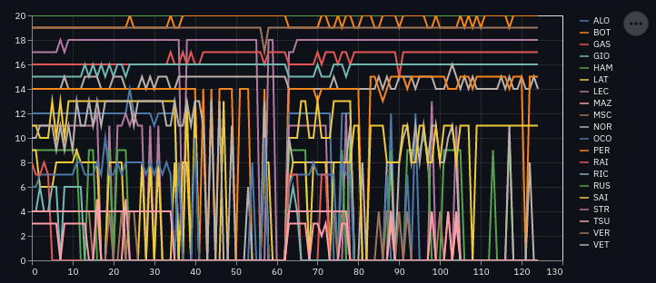

# Formula One Race Lap-by-Lap Prediction with Machine Learning

This website features two machine learning models that can predict lap times, positions, pit stop strategies as well as events like collisions for up to 20 drivers throughout a whole race.

Other features:
- 2 models to choose from. One trained with 20 years of data, the other trained with historical pit stop data starting from 2012 (This model is currently not available due to size limitations).
- Interactive slider to look at lap times, statuses, etc of any lap during the race.
- Colorful graph to easily grasp drivers' positions through out the race.  

- 20 years of historical data to predict what could have happened. Using the [Ergast Developer API](http://ergast.com/mrd/), you can choose from any race since 2001 and let the model envision an alternate ending.
- Randomness factor to add unlimited possibilities.

Some predictions made by the models:
- This is a prediction on the 2021 Imola Grand Prix. While the model could not accurately predict crashes, the results are sensible.  

- Some predictions are quite far off reality. This is a prediction on a 2020 race. The model predicted that Hass would have two drivers on the podium.  

- With a lot of added randomness, the model gives very eventful races.  

## More on the making of the models [here](./notebooks/README.md).

## This website uses [SessionState](https://gist.github.com/tvst/036da038ab3e999a64497f42de966a92) by [tvst](https://gist.github.com/tvst).
